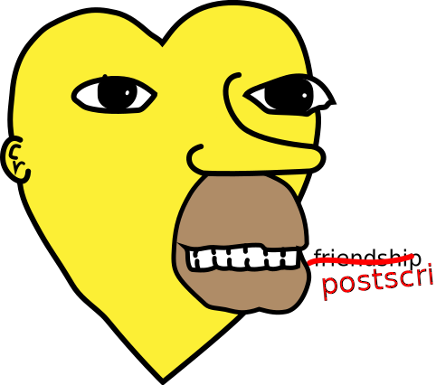

# PostScript snippets that I gone and dun.

Because who doesn't love a good `gs -sDEVICE=txtwrite -sOutputFile=- -q -sBATCH -dNOPAUSE -dNOSAFER *.ps`…?

 

### [`asciify.ps`](asciify.ps)
An experiment in monkey-patching fixed-pitch typefaces to use ASCII quotes, instead of their directional Unicode counterparts. Doesn't work in `PSNormalizer.framework` (i.e., macOS/`Preview.app`); requires specific placement after a document's prologue (but before any rendered content).

### [`inspect.ps`](inspect.ps)
A recursive inspection function that prints spiffy-looking colours to stdout. Basically, what `==` would be if it didn't suck at inspecting substructures:

### [`lists.ps`](lists.ps)
Despite being a stack-based language, PostScript has surprisingly limited functions for manipulating arrays and lists. Those I deem missing will eventually find their way into this file.
